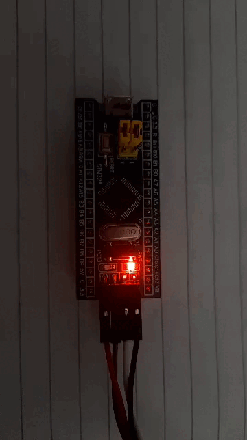

# STM32F103 BareMetal Blink LED Programming without IDE

This repository contains a bare-metal blink LED project for the STM32F103 microcontroller (Bluepill board). The project is developed without using any Integrated Development Environment (IDE), using only a text editor, and compiled with the `arm-none-eabi-gcc` compiler. The flashing process is accomplished using ST-Link.

## Table of Contents

- [Prerequisites](#prerequisites)
- [Getting Started](#getting-started)
- [Usage](#usage)
- [Capturing LED Output](#capturing-led-output)
- [Contributing](#contributing)
- [License](#license)

## Prerequisites

Before you begin, ensure you have the following prerequisites installed on your development environment:

- **arm-none-eabi-gcc**: The GNU Compiler Collection toolchain for compiling ARM-based applications. You can download it from [here](https://developer.arm.com/tools-and-software/open-source-software/developer-tools/gnu-toolchain/gnu-rm).
- **ST-Link Utility**: Software utility for flashing firmware onto STM32 microcontrollers. You can download it from [here](https://www.st.com/en/development-tools/stsw-link004.html).

## Getting Started

Follow these steps to compile and flash the project onto your STM32F103 microcontroller:

1. **Clone the Repository**: Clone this repository to your local machine using the following command:

    ```bash
    git clone https://github.com/sudheerthan/STM32_BareMetal_Programming
    ```

2. **Navigate to the Project Directory**: Change into the project directory:

    ```bash
    cd STM32_BareMetal_Programming
    ```

3. **Compile the Project**: Compile the project using `arm-none-eabi-gcc`:

    ```bash
    arm-none-eabi-gcc main.c startup.c -T linker_script.ld -o blink.elf -mcpu=cortex-m3 -mthumb -nostdlib
    ```

4. **Flash the Binary**: Flash the compiled binary onto your STM32F103 microcontroller using ST-Link:

    ```bash
    st-flash write blink.bin 0x08000000
    ```

## Usage

Once the project is successfully flashed onto the microcontroller, the on board LED connected to pin PC13 will start blinking at a predefined rate. You can modify the code in `main.c` to customize the blink pattern or add additional functionality as needed.

## Capturing LED Output

To capture a picture of the LED output:

1. **Prepare the Setup**: Set up your STM32F103 board with the LED connected to pin PC13.
2. **Run the Program**: Power on the board and observe the LED blinking.
3. **Capture Picture**: Use a camera or smartphone to capture a picture of the LED output.



## Contributing

Contributions to this project are welcome! If you encounter any issues, have suggestions for improvements, or want to add new features, please feel free to open an issue or submit a pull request.

## License

This project is licensed under the MIT License. See the [LICENSE](LICENSE) file for details.
